## GraphTheory.NET

It has been a while since I posted anything. There have been lots of things happening behind the scenes, but it has resulted in some good news: the latest version of the GraphTheory NuGet package should let developers easily build graphs.

*Note: This is meant to be a form of "living documentation"; however there may be some things that are out of sync. Use this more as a guide and I will pump out some MSDN like documenation soon.*

### New Graph Objects

Right now, there are two primar types of graphs supported by the GraphTheory.NET API: undirected and weighted-undirected graphs. Let's start with the easiest type of graph, check it out:

```cs
var graph = new Graph< int >();
```

You can see that the `graph` object represents an unweighted and undirected graph where the nodes hold on to `int` data. New graphs are always empty and you have to populate the graph with nodes and edges (read on).

#### What about weighted graphs?

Creating a weighted and undirected graph is just as easy, check it out:

```cs
var graph = new Graph< int,float >();
```

In this case, the `graph` object represents a weighted and undirected graph where the nodes hold onto `int` data and the weights are represented by `float` data. Again, new graphs are always empty and you have to poulate the graph with nodes and edges.

### Wiring-Up Graphs

Okay, so we can create a graph object, then what do we do? Let's fill it up with some data:

```cs
var graph = new Graph< string >();
graph.Insert("a", "b", "c", "d", "e");
```

This will create the following graph:


#### Okay but where are the edges?

This is where the GraphTheory.NET library makes a lot of sense. We are trying to make it brain dead simple to create graphs. Turns out we think that means it should be easy to specify the edges (its pretty brain dead simple to specify nodes already). Check out the following:

```cs
var graph = new Graph< string >();
graph.Insert("a", "b", "c", "d", "e");
graph.Select("a").ConnectTo("b").ThenTo("c").ThenTo("d", "e");
```

This will produce the following graph:


#### And what about weighted Graphs?

I have yet to write the code to make the following work; however, I do think that its fairly easy to write---I just need to find the time. Anyway, I have been thinking about this one a lot and I think I found a way that makes sense but there is a small catch... 

Okay, lets add weights to the graph above. How do we do that?

```cs
var graph = new Graph< string,int >();
graph.Insert("a", "b", "c", "d", "e");
graph.Select("a").ConntectTo("b").Weighing(1)
                 .ThenTo("c").Weighing(2)
                 .ThenTo("d", "e").Weighing(3);
```

This will create the following graph:


So, what's the catch? I think its easier if you see it yourself. Let's break this down one step at a time. First, let's connect `a` and `b` together.

```cs
var graph = new Graph< string,int >();
graph.Insert("a", "b", "c", "d", "e");
graph.Select("a").ConntectTo("b");
```

What does our graph look like now?

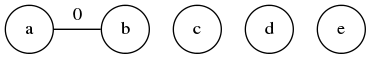

What's with the `0`? Well, since you haven't specified a weight yet, you get the default value associated with the weight type. If you rolled out your own custom weight class, then it would be null; however, if it was a struct then it would be created with the default constructor. Let's continue.

```cs
graph.Select("a").ConnectTo("b").Weighing(1);
```
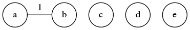

The rest would look like this:

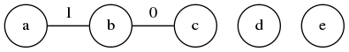

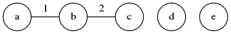

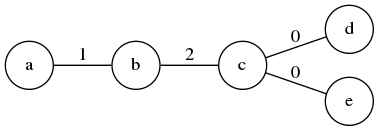

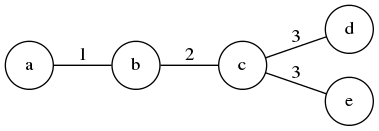

Its just something to keep in mind. You can always use some sort of synchronization construct (lock, semaphor, mutex, etc.) if this sort of behavior is a problem.

### Querying the graph

Now that you can create a graph with a specific structure that you want, you might also want to query the graph. For example, you might want to find out which nodes are adjacent to a specific node. Or, what are all the edges connecting to a specific node. Use the following graph to familiarize yourself with these concepts.

```cs
var g = new Graph< string >();
g.Insert("a", "b", "c", "d", "e", "f", "g", "h", "i", "j");
g.Select("a").ConnectTo("b")
             .ThenTo("c").ThenTo("d").ThenTo("e").ThenTo("a");
g.Select("a").ConnectTo("f");
g.Select("b").ConnectTo("g");
g.Select("c").ConnectTo("h");
g.Select("d").ConnectTo("i");
g.Select("e").ConnectTo("j");
```

It will produce the following graph:

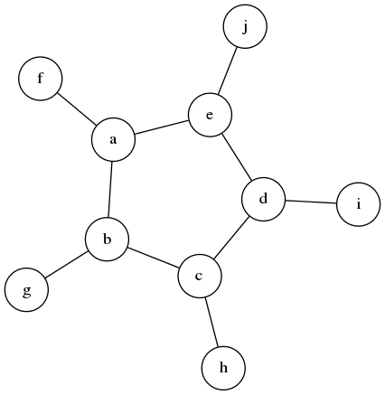

#### Selecting one or more nodes directly

You have already seen the use of the `Select` method from a graph. Let's select the nodes `a`, `b`, and `c` by using the data directly.

```cs
var nodes = g.Select("a", "b", "c"); // selects nodes by data values
```

Pretty straight forward. Let's see what it looks like in the example graph. *Let the red nodes indicate the return value of the selection.*

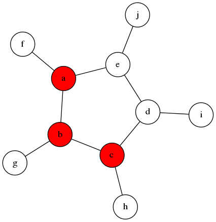

If you happen to know the `Id` of the node you are looking for you can also select the node itself.

```cs
var g = new Graph< int >();
var nodeId = g.Insert("a").Id;
// ... construct the reset of the graph ...
var a = g.Select(nodeId);
```

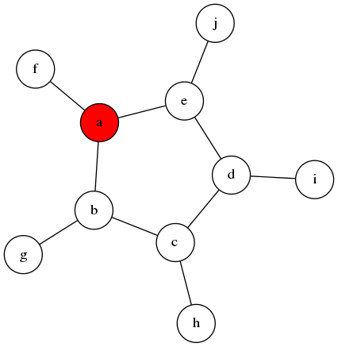

Actually, under the hood when you select by data values, the data values translate to `NodeId` objects which are then used to acquire the `GraphNode` reference.

#### Selecting adjacent nodes directly

Often times, many graph-based algorithms will require access to the *adjacent* nodes of a given node.

> An adjacent node of a node $v$ in a graph is a node that is connected to $v$ by an edge.

This is such an important form of selection that its built-in to the GraphTheory.NET library. There are two ways to access the adjacent nodes: you can qurey the graph itself, or you can query a node directly. Here is how you can query the graph for the adjacent nodes to `a` in our example graph:

```cs
...
var nodeId = g.Insert("a").Id;
...
var adjacentNodeIds = g.SelectAdjacentTo(nodeId);
var adjacentNodes = g.Select(adjacentNodeIds);
```

If we let *yellow* indicate the root, then we see it easily below:

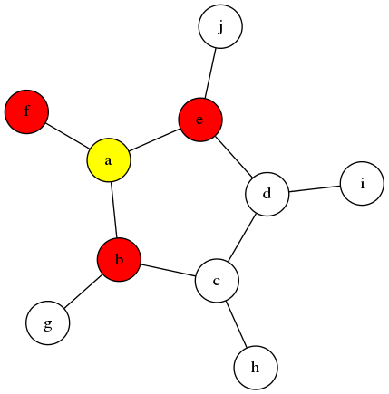

If you have a reference to the adjacent node's root, then you can access the adjacent nodes like so:

```cs
var node = g.Select("a");
var adjacentNodes = node.SelectAdjacent();
```

#### Selecting edges

While most of the time you create nodes and implicitly create edges, there may be times that you need to access those edges directly. Perhaps you need to edit a graph by removing an edge? Perhaps you need to update the weight of an edge?

You have a couple of options to access edges. You can create the edge manually and keep track of the `Id`.

```cs
var nodes = new HashSet< NodeId > { nodeA.Id, nodeE.Id };
var edge = new UndirectedEdge(nodes); // automatically creates and Id
var edgeId = edge.Id;
g.Insert(edge);
...
var e = g.Select(edgeId);
```

The other option is that you might get to an edge through a node. For example:

```cs
var a = g.Select("a");
var edgeIds = g.SelectConnectedTo(a.Id);
var edgeId = edgeIds.First(); // assume that this connects "a" to "e"
var edge = g.Select(edgeId);
```

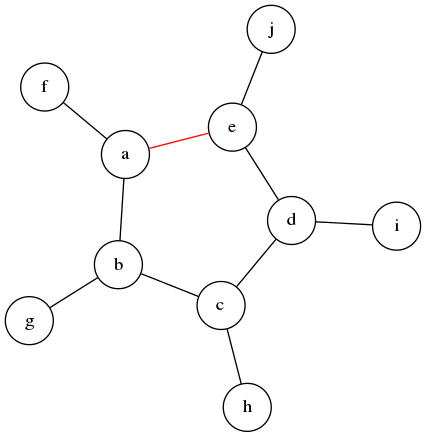

#### Selecting nodes from edges

You can query the graph or the edge to access the nodes connected to them. In either case, you need the edge's `Id`.

```cs
var edgeId = ...;
var nodeIds = g.SelectConnectedTo(edgeId);
var nodes = g.Select(nodeIds.ToArray());
```

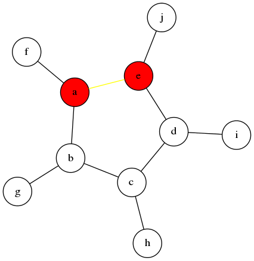

*Note: Remember that yellow indicates the root of the selection.*

If you have a reference to the edge itself, you can access the nodes connected to the edge like this:

```cs
var nodeIds = edge.NodeIds();
var nodes = g.Select(nodeIds.ToArray());
```

### Modifying the graph structure

You have already seen what it takes to create several graphs. `Insert` nodes into a graph object and then use the fluent API to connect nodes. What happens if you need to remove a node once it has been added to the graph? How does that work?

#### Removing an edge

The easiest thing to remove is an edge. This is because it doesn't change the graph too much. Let's attempt to remove the edge between `a` and `e` in our example graph.

```cs
var edgeId = ...; // assume this is the edge between "a" and "e"
g.Remove(edgeId);
```

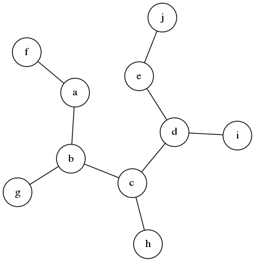

#### Removing a node

When removing a node, it makes sense to also remove all the edges that connect to that node. Let's attempt to remove node `a` from our example graph.

```cs
var a = g.Select("a");
g.Remove(a.Id);
```


